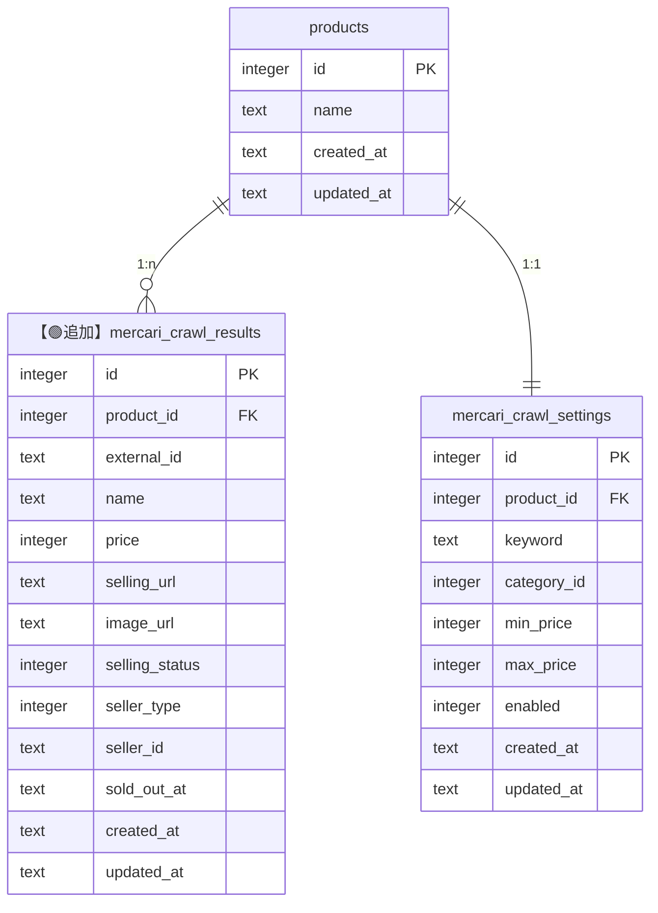
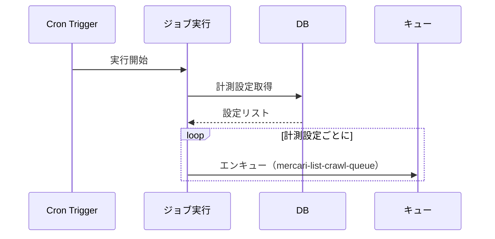
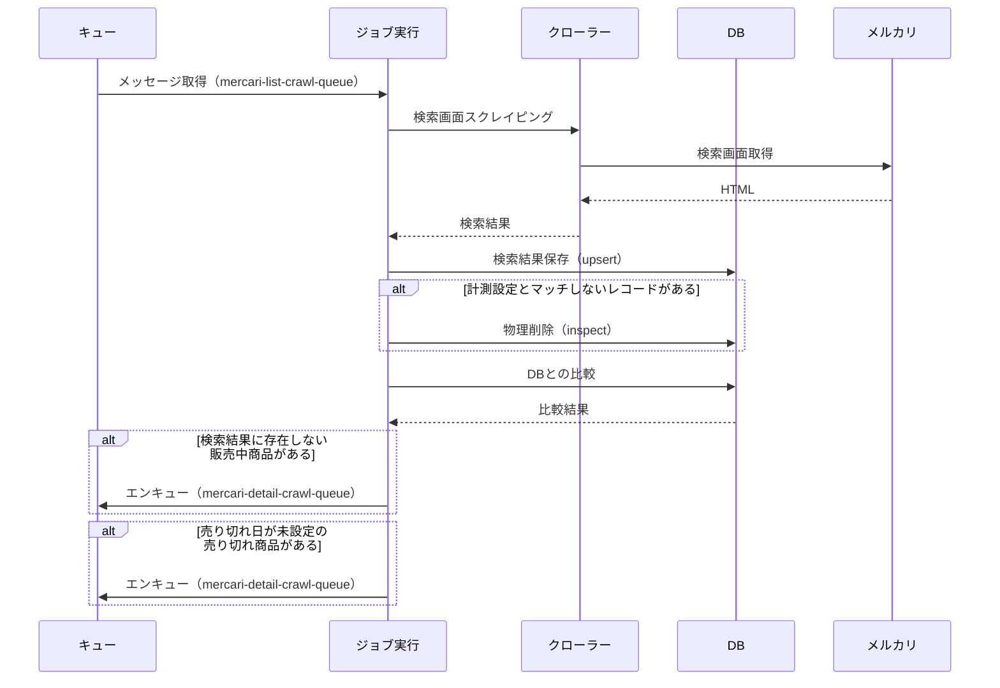
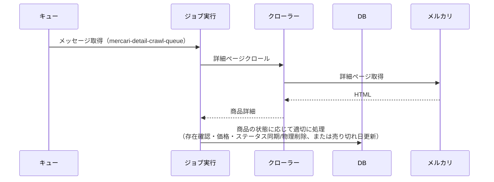

# 目的

- REQ-0001: スクレイピング機能の実装に関する統合ドキュメント
- 要件定義と詳細設計を統合した実装用ドキュメント

# 要件ジャッジ結果

## やるべきか

- Yes

## 優先度

- 高

## 影響範囲メモ

- データベース: 新規テーブル追加が必要
- バックエンド: スクレイピング処理、ジョブ実行機能の実装が必要
- インフラ: Cloudflare Workers の Cron Triggers 設定が必要（1時間ごとの実行）
- 外部依存: メルカリのHTML構造に依存（変更時に影響を受ける可能性）
- 法的リスク: スクレイピングの利用規約遵守が必要
- ban対策: VPS経由の実装を検討中（要検討）
- エラー通知: BugSnag通知の実装が必要

## 判断理由

- プロジェクトのコア機能: README.md のロードマップに明記されており、価格監視ツールとして必須の機能
- 既存インフラとの整合性: Cloudflare Workers は Cron Triggers をサポートしており、バックグラウンドジョブ実行が可能
- データ構造の準備: `mercari_crawl_settings` テーブルが既に存在し、スクレイピング条件が管理可能な状態
- 段階的な実装が可能: まずは手動実行から開始し、後でCron Trigger化が可能

# データ設計方針

## 新規テーブル: `mercari_crawl_results`

### 追加理由

- スクレイピング結果を格納して永続化するためのテーブル
- 購入済みステータスの本レコードを集計することで相場推移を見れる
- 出品中ステータスの本レコードを画面描画することで最安商品を見れる

### カラム詳細

| カラム名 | 型 | NOT NULL | FK制約 | デフォルト値 | 説明 |
|---------|-----|---------|--------|------------|------|
| `id` | integer | あり | - | - | 主キー（自動インクリメント） |
| `product_id` | integer | あり | products.id | - | productsテーブルへの外部キー |
| `external_id` | text | あり | - | - | メルカリ商品ID（外部システムのID） |
| `name` | text | あり | - | - | 商品名 |
| `price` | integer | あり | - | - | 価格 |
| `selling_url` | text | あり | - | - | 商品URL |
| `image_url` | text | あり | - | - | 商品画像URL |
| `selling_status` | integer | あり | - | - | 販売ステータス（1: 販売中、2: 売り切れ） |
| `seller_type` | integer | あり | - | - | 出品者タイプ（1: 一般ユーザー、2: ショップ） |
| `seller_id` | text | あり | - | - | 出品者ID（seller_typeに応じて一般ユーザーIDまたはショップID） |
| `sold_out_at` | text | なし | - | - | 売り切れ日時 |
| `created_at` | text | あり | - | CURRENT_TIMESTAMP | 作成日時 |
| `updated_at` | text | あり | - | CURRENT_TIMESTAMP | 更新日時 |

### インデックス

| インデックス名 | カラム名 | ユニーク制約 | 説明 |
|-------------|---------|------------|------|
| PRIMARY KEY | `id` | あり（clustered） | 主キー（自動的にclustered indexとして作成） |
| `product_external_unique_idx` | `product_id`, `external_id` | あり | 重複防止 |
| `product_id_idx` | `product_id` | なし | 計測設定単位でデータ取得するときに利用する |
| `external_id_idx` | `external_id` | なし | クロール結果との突き合わせで必要 |
| `created_at_idx` | `created_at` | なし | |
| `updated_at_idx` | `updated_at` | なし | |

### ER



## 既存テーブルへの影響

- 影響なし

# 実行フロー設計

## 全体フロー

### Cron Trigger実行時

1. 実行開始（Cron Trigger）
2. enabled=trueの計測設定を取得
3. 各計測設定に対して以下を実行:
   - 検索画面クローリング用のメッセージを `mercari-list-crawl-queue` にエンキュー

### キューから取り出されたメッセージ（listCrawl）実行時

1. メッセージから計測設定IDを取得
2. 検索画面をスクレイピング（初回は全ページ、それ以外は2-3ページ）
3. `upsert`:
   - 検索結果をバルクupsertでDBに保存（重複チェックはDB側のユニーク制約で行う
   - selling_statusは更新可能だがsold_out_atは検索画面にないため未設定のまま）
4. `inspect`:
   - 計測設定とマッチしないレコードを物理削除
5. `syncForExistence`:
   - 検索結果に含まれない販売中商品（`selling_status=1`）のリストを取得
   - 各商品を `mercari-detail-crawl-queue` にエンキュー
6. `syncForSoldOutAt`:
   - 売り切れ日が未設定の売り切れ商品（`selling_status=2`かつ`sold_out_at=NULL`）のリストを取得
   - 各商品を `mercari-detail-crawl-queue` にエンキュー

### キューから取り出されたメッセージ（detailCrawl）実行時

1. メッセージから商品IDを取得
2. `detail/syncer.ts` の `detailCrawl` を実行
3. 詳細ページでクロールして、商品の状態に応じて適切に処理（存在確認・価格・ステータス同期/物理削除、または売り切れ日更新）

### 手動実行時

1. 実行開始（手動実行）
2. enabled=trueの計測設定を取得
3. 各計測設定に対して以下を実行（同期的に実行）:
   - 検索画面をスクレイピング（初回は全ページ、それ以外は2-3ページ）
   - `upsert`、`inspect`、`syncForExistence`、`syncForSoldOutAt` を順次実行
   - `syncForExistence`と`syncForSoldOutAt`は、対象商品を`mercari-detail-crawl-queue`にエンキュー（非同期処理）

## シーケンス図

### Cron Trigger実行時



### キューから取り出されたメッセージ（listCrawl）実行時



### キューから取り出されたメッセージ（detailCrawl）実行時



# 非同期ジョブ設計

## Cloudflare Queuesの利用

詳細ページのクロール処理は非同期で実行するため、Cloudflare Queuesを利用する。

### キュー名

- `mercari-list-crawl-queue`: メルカリリストクロール用のキュー
- `mercari-detail-crawl-queue`: メルカリ詳細クロール用のキュー
- ジョブの種類（リストクロール、詳細クロール）とキューの種類を一致させる

### メッセージ型定義

```typescript
// mercari-list-crawl-queue 用
type ListCrawlMessage = { productId: number };

// mercari-detail-crawl-queue 用
type DetailCrawlMessage = { mercariCrawlResultId: number };
```

### エンキュー処理

- Cron Trigger実行時:
  - `jobs/crawl.ts` の `executeCrawlJob` で、各計測設定のメッセージを `mercari-list-crawl-queue` にエンキュー
- `list/syncer.ts` の `syncForExistence` と `syncForSoldOutAt`:
  - 対象商品のIDを `mercari-detail-crawl-queue` にエンキュー
- エンキュー対象の絞り込み方法は異なるが、エンキューするキューは同じ（`mercari-detail-crawl-queue`）
- `env.QUEUE_LIST.send()` と `env.QUEUE_DETAIL.send()` を使用してメッセージを送信
- バッチ送信（`sendBatch`）を利用して効率化
- `env` の型定義（`worker-configuration.d.ts`）に追加:
  - `QUEUE_LIST: Queue<ListCrawlMessage>`
  - `QUEUE_DETAIL: Queue<DetailCrawlMessage>`

### キューコンシューマー

- `app.ts` の `queue` ハンドラーでメッセージを受信:
  - キューごとに別々のハンドラー
- `mercari-list-crawl-queue` のハンドラー:
  - `list/crawler.ts` と `list/syncer.ts` を実行
- `mercari-detail-crawl-queue` のハンドラー:
  - `detail/syncer.ts` の `detailCrawl` を実行（商品の状態に応じて適切に処理）
- `MessageBatch` からメッセージを取得
- エラー発生時は自動リトライ（Cloudflare Queuesの標準機能）

### 設定

- `wrangler.jsonc` に `queues.producers` と `queues.consumers` を追加:
  - `mercari-list-crawl-queue` の producer と consumer
  - `mercari-detail-crawl-queue` の producer と consumer
- 環境変数でキュー名を指定:
  - 開発環境と本番環境で分離可能

# 変更対象ファイル・関数

## ディレクトリ構造

```
backend/
├── models/
│   └── mercariCrawlResults.ts   # 【🟢追加】クロール結果データモデル
├── services/
│   └── mercari/
│       ├── list/
│       │   ├── crawler.ts       # 【🟢追加】検索画面スクレイピング
│       │   └── syncer.ts        # 【🟢追加】検索画面同期
│       ├── detail/
│       │   ├── crawler.ts       # 【🟢追加】詳細画面スクレイピング
│       │   └── syncer.ts        # 【🟢追加】詳細画面同期
├── api/
│   ├── crawl.ts                 # 【🟢追加】クロールAPI
│   └── index.ts                 # 【変更】ルート追加
├── jobs/
│   └── crawl.ts                 # 【🟢追加】Cronジョブ実行処理
├── schemas/
│   └── mercariCrawlResults.ts   # 【🟢追加】クロール結果スキーマ
├── db/
│   └── schema.ts                # 【変更】テーブル定義追加
└── app.ts                       # 【変更】scheduledハンドラー追加
```

## 新規作成ファイル

### `backend/services/mercari/list/crawler.ts`

変更概要:

- メルカリ検索画面のスクレイピング処理（データ構築のみ、DBには触らない）

実装内容:

- `crawlMercariList(product, isFirstRun)`:
  - 検索画面のスクレイピング（初回は全ページ、それ以外は2〜3ページ）
  - 戻り値: 検索結果データ

### `backend/services/mercari/list/syncer.ts`

変更概要:

- 検索画面の同期処理（DBコミット）

実装内容:

- `upsert(db, crawlResults)`:
  - 検索結果をバルクupsertでDBに保存
- `inspect(db, product)`:
  - 計測設定とマッチしないレコードを物理削除
- `syncForExistence(db, product, searchResults)`:
  - 検索結果に含まれない販売中商品のリストを取得
  - 各商品をキューにエンキュー（非同期処理）
- `syncForSoldOutAt(db, product)`:
  - 売り切れ日が未設定の売り切れ商品のリストを取得
  - 各商品をキューにエンキュー（非同期処理）

### `backend/services/mercari/detail/crawler.ts`

変更概要:

- メルカリ詳細画面のスクレイピング処理（データ構築のみ、DBには触らない）

実装内容:

- `crawlMercariDetail(mercariCrawlResult)`:
  - 商品詳細画面のスクレイピング（存在確認・売り切れ日取得）
  - 戻り値: 商品詳細データ

### `backend/services/mercari/detail/syncer.ts`

変更概要:

- 詳細画面の同期処理（DBコミット）

実装内容:

- `detailCrawl(db, mercariCrawlResult)`:
  - キューから取り出された個別の商品に対して実行
  - 詳細ページでクロールして、商品の状態に応じて適切に処理
  - 販売中商品（`selling_status=1`）の場合:
    - 存在確認・価格・ステータス同期/物理削除
  - 売り切れ商品（`selling_status=2`かつ`sold_out_at=NULL`）の場合:
    - 売り切れ日更新

### `backend/models/mercariCrawlResults.ts`

変更概要:

- クロール結果のデータモデル層（基本的なCRUD操作のみ）

実装内容:

- `upsert(db, crawlResults)`:
  - バルクupsert操作（重複チェックはDB側のユニーク制約で行う）
- `findByProductId(db, productId)`:
  - 商品IDで一括取得（結果表示用）
- `delete(db, id)`:
  - レコード削除
- `update(db, id, data)`:
  - レコード更新

### `backend/api/crawl.ts`

変更概要:

- 手動実行用APIエンドポイント

実装内容:

- `POST /api/crawl/execute`:
  - 手動実行エンドポイント（実装初期段階で使用、`list/crawler`でデータ構築後、`list/syncer`と`detail/syncer`を順番に実行）
- `GET /api/crawl/results/:productId`:
  - クロール結果取得エンドポイント
- OpenAPIHono形式で実装
- 認証ミドルウェア適用

### `backend/jobs/crawl.ts`

変更概要:

- Cron Trigger用のジョブ実行処理（エンキュー処理のみ）
- キュー処理用のジョブ実行処理

実装内容:

- `executeCrawlJob(env)`:
  - Cron Triggerから呼び出されるメイン関数
  - enabled=trueの計測設定を取得し、各設定のメッセージを`mercari-list-crawl-queue`にエンキュー
- `getEnabledCrawlSettings(db)`:
  - enabled=trueの設定を取得（productsとmercari_crawl_settingsをJOIN）
- `processListCrawlQueue(batch, env)`:
  - `mercari-list-crawl-queue` から取り出されたメッセージを処理
  - `list/crawler.ts`でデータ構築後、`list/syncer.ts`を実行
- `processDetailCrawlQueue(batch, env)`:
  - `mercari-detail-crawl-queue` から取り出されたメッセージを処理
  - `detail/syncer.ts`の`detailCrawl`を実行（商品の状態に応じて適切に処理）

### `backend/schemas/mercariCrawlResults.ts`

変更概要:

- クロール結果のZodスキーマ定義

実装内容:

- `MercariCrawlResultSchema`:
  - 検索結果のスキーマ
- `MercariItemDetailSchema`:
  - 商品詳細のスキーマ
- `CrawlResultSchema`:
  - DB保存用のスキーマ
- OpenAPI用のスキーマ定義

## 変更ファイル

### `backend/db/schema.ts`

変更概要:

- `mercari_crawl_results` テーブルの追加

変更内容:

- `mercariCrawlResults` テーブル定義を追加
- 既存のテーブル定義に影響なし

### `backend/app.ts`

変更概要:

- `scheduled` ハンドラーの追加（Cron Trigger対応）
- `queue` ハンドラーの追加（キュー処理対応）

変更内容:

- `export const scheduled` ハンドラーを追加
- `backend/jobs/crawl.ts` の `executeCrawlJob` を呼び出す（エンキュー処理のみ）
- `export const queue` ハンドラーを追加（キューごとに別々のハンドラー）
- `mercari-list-crawl-queue` のハンドラー:
  - `backend/jobs/crawl.ts` の `processListCrawlQueue` を呼び出す
- `mercari-detail-crawl-queue` のハンドラー:
  - `backend/jobs/crawl.ts` の `processDetailCrawlQueue` を呼び出す
- 実装初期段階では手動実行のみ、後でCron実行を追加

### `backend/api/index.ts`

変更概要:

- クロールAPIルートの追加

変更内容:

- `backend/api/crawl.ts` からルートとハンドラーをインポート
- `/api/crawl/*` ルートを追加
- 認証ミドルウェア適用

### `wrangler.jsonc`

変更概要:

- Cron Trigger設定の追加
- キュー設定の追加

変更内容:

- `triggers.crons` に `"0 * * * *"`（1時間ごと）を追加
- 実装初期段階では設定しない（手動実行のみ）
- `queues.producers` に `mercari-list-crawl-queue` と `mercari-detail-crawl-queue` を追加（キューへの送信権限）
- `queues.consumers` に `mercari-list-crawl-queue` と `mercari-detail-crawl-queue` を追加（キューからの受信権限）

# 実装順序

## Phase 1: 手動実行機能の実装（初期段階）

### データベーススキーマ作成

- `backend/db/schema.ts` に `mercariCrawlResults` テーブル定義を追加
- マイグレーションファイル生成・実行

### スクレイピング処理の実装

- `backend/services/mercari/list/crawler.ts` を作成
- `backend/services/mercari/detail/crawler.ts` を作成
- 検索画面スクレイピング機能を実装
- 商品詳細画面スクレイピング機能を実装

### データモデル層の実装

- `backend/models/mercariCrawlResults.ts` を作成
- CRUD操作を実装

### 手動実行APIの実装

- `backend/api/crawl.ts` を作成
- `POST /api/crawl/execute` エンドポイントを実装
- `backend/api/index.ts` にルートを追加

### 検索結果とDBの比較処理実装

- `backend/services/mercari/list/syncer.ts` を作成
- `upsert`、`inspect`、`syncForExistence` 関数を実装
- `backend/services/mercari/detail/syncer.ts` を作成
- `detailCrawl` 関数を実装
- `backend/jobs/crawl.ts` を作成
- `processListCrawlQueue` と `processDetailCrawlQueue` 関数を実装

### キュー設定の実装

- `wrangler.jsonc` にキュー設定を追加
- `backend/app.ts` に `queue` ハンドラーを追加
- 環境変数の型定義を追加

## Phase 2: Cron実行機能の追加（最終段階）

### Cron Trigger設定

- `wrangler.jsonc` に `triggers.crons` を追加
- `"0 * * * *"`（1時間ごと）を設定

### scheduledハンドラーの実装

- `backend/app.ts` に `scheduled` ハンドラーを追加
- `backend/jobs/crawl.ts` の `executeCrawlJob` を呼び出す

### エラーハンドリング強化

- BugSnag通知の実装
- エラーログの出力

# 開発工数見積

## Phase 1: 手動実行機能の実装（初期段階）

| タスク | 工数（時間） | 備考 |
|--------|------------|------|
| データベーススキーマ作成 | 2h | テーブル定義、マイグレーション |
| スクレイピング処理の実装 | 16h | リスト・詳細画面のスクレイピング実装 |
| データモデル層の実装 | 4h | CRUD操作の実装 |
| 手動実行APIの実装 | 4h | APIエンドポイントの実装 |
| 検索結果とDBの比較処理実装 | 12h | syncer実装、キューエンキュー処理 |
| キュー設定の実装 | 4h | wrangler.jsonc設定、queueハンドラー |
| テスト・デバッグ | 8h | 動作確認、バグ修正 |
| **合計** | **50h** | **約6.25人日** |

## Phase 2: Cron実行機能の追加（最終段階）

| タスク | 工数（時間） | 備考 |
|--------|------------|------|
| Cron Trigger設定 | 1h | wrangler.jsonc設定 |
| scheduledハンドラーの実装 | 2h | app.tsへの追加 |
| エラーハンドリング強化 | 4h | BugSnag通知、ログ出力 |
| テスト・デバッグ | 3h | 動作確認、バグ修正 |
| **合計** | **10h** | **約1.25人日** |

## 総工数

- **Phase 1 + Phase 2**: 60h（約7.5人日）

# 安全にリリースするための段階的な機能アップデート方針

## Step 1: 手動実行での動作確認（Phase 1完了後）

- 手動実行API（`POST /api/crawl/execute`）で動作確認
- 小規模なデータでテスト実行
- エラーハンドリングの確認
- データの整合性確認

## Step 2: キュー処理の動作確認

- ローカル環境（`wrangler dev`）でキュー処理をテスト
- メッセージのエンキュー・デキューが正常に動作することを確認
- エラー時のリトライ動作を確認

## Step 3: 本番環境への段階的デプロイ

- まずは手動実行のみをデプロイ（Cron Triggerは無効）
- 本番環境で手動実行を数回実施し、動作を確認
- 問題がなければ次のステップへ

## Step 4: Cron Triggerの有効化

- `wrangler.jsonc` の `triggers.crons` を有効化
- 最初の1時間で動作を監視
- エラーが発生した場合は即座にCron Triggerを無効化

## Step 5: 監視・最適化

- BugSnagでエラーを監視
- キューの滞留状況を監視
- パフォーマンスを確認し、必要に応じて最適化

# 画面設計方針

- 不要:
  - バックグラウンド処理のため、直接的な画面変更は不要
- 将来の拡張:
  - クロール結果を表示する画面が必要になる可能性あり（別要件として検討）

# 未確定事項 & TODO

- 【要確認】ban対策:
  - VPS経由のスクレイピング実装（要検討）
  - 現時点では直接実装を想定
- 【要確認】データ保持期間:
  - 無期限としているが、データ量の増加にともない要検討
  - 将来的にデータ削除ポリシーの検討が必要
- 【TODO】BugSnag通知の実装:
  - エラー発生時の通知機能を実装
- 【TODO】メルカリの利用規約確認:
  - スクレイピングの利用規約遵守が必要
