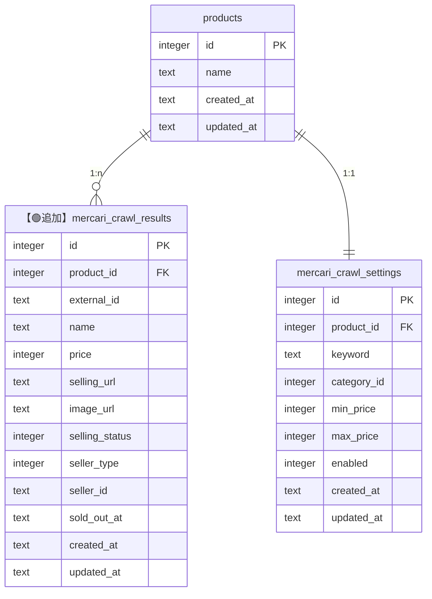
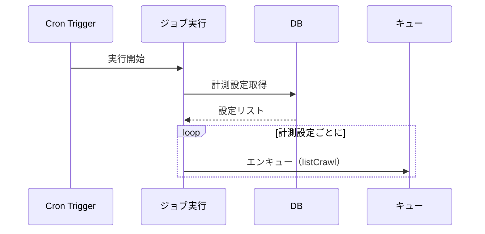
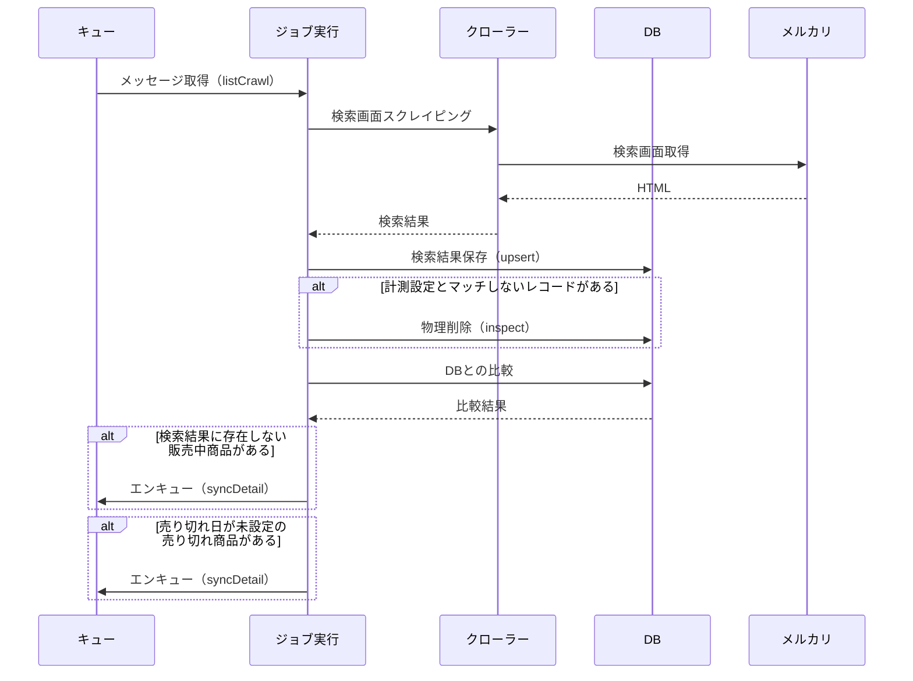
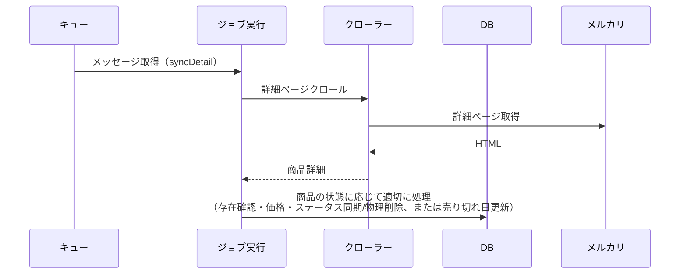

# 目的

- REQ-0001: スクレイピング機能の実装に関する詳細設計を実施する
- 要件定義で定義した機能を実装するための詳細な設計を定義する

# データ設計方針

## 新規テーブル: `mercari_crawl_results`

### 追加理由

- スクレイピング結果を格納して永続化するためのテーブル
- 購入済みステータスの本レコードを集計することで相場推移を見れる
- 出品中ステータスの本レコードを画面描画することで最安商品を見れる

### カラム詳細

| カラム名 | 型 | NOT NULL | FK制約 | デフォルト値 | 説明 |
|---------|-----|---------|--------|------------|------|
| `id` | integer | あり | - | - | 主キー（自動インクリメント） |
| `product_id` | integer | あり | products.id | - | productsテーブルへの外部キー |
| `external_id` | text | あり | - | - | メルカリ商品ID（外部システムのID） |
| `name` | text | あり | - | - | 商品名 |
| `price` | integer | あり | - | - | 価格 |
| `selling_url` | text | あり | - | - | 商品URL |
| `image_url` | text | あり | - | - | 商品画像URL |
| `selling_status` | integer | あり | - | - | 販売ステータス（1: 販売中、2: 売り切れ） |
| `seller_type` | integer | あり | - | - | 出品者タイプ（1: 一般ユーザー、2: ショップ） |
| `seller_id` | text | なし | - | - | 出品者ID（seller_typeに応じて一般ユーザーIDまたはショップID） |
| `sold_out_at` | text | なし | - | - | 売り切れ日時 |
| `created_at` | text | あり | - | CURRENT_TIMESTAMP | 作成日時 |
| `updated_at` | text | あり | - | CURRENT_TIMESTAMP | 更新日時 |

### インデックス

| インデックス名 | カラム名 | ユニーク制約 | 説明 |
|-------------|---------|------------|------|
| PRIMARY KEY | `id` | あり（clustered） | 主キー（自動的にclustered indexとして作成） |
| `product_external_unique_idx` | `product_id`, `external_id` | あり | 重複防止 |
| `product_id_idx` | `product_id` | なし | 計測設定単位でデータ取得するときに利用する |
| `external_id_idx` | `external_id` | なし | クロール結果との突き合わせで必要 |
| `created_at_idx` | `created_at` | なし | |
| `updated_at_idx` | `updated_at` | なし | |

### ER



## 既存テーブルへの影響

- 影響なし

# 実行フロー設計

## 全体フロー

### Cron Trigger実行時

1. 実行開始（Cron Trigger）
2. enabled=trueの計測設定を取得
3. 各計測設定に対して以下を実行:
   - 検索画面クローリング用のメッセージをキューにエンキュー（`listCrawl` タイプ）

### キューから取り出されたメッセージ（listCrawl）実行時

1. メッセージから計測設定IDを取得
2. 検索画面をスクレイピング（初回は全ページ、それ以外は2-3ページ）
3. `upsert`:
   - 検索結果をバルクupsertでDBに保存（重複チェックはDB側のユニーク制約で行う
   - selling_statusは更新可能だがsold_out_atは検索画面にないため未設定のまま）
4. `inspect`:
   - 計測設定とマッチしないレコードを物理削除
5. `syncForExistence`:
   - 検索結果に含まれない販売中商品（`selling_status=1`）のリストを取得
   - 各商品をキューにエンキュー（`syncDetail` タイプ）
6. `syncForSoldOutAt`:
   - 売り切れ日が未設定の売り切れ商品（`selling_status=2`かつ`sold_out_at=NULL`）のリストを取得
   - 各商品をキューにエンキュー（`syncDetail` タイプ）

### キューから取り出されたメッセージ（syncDetail）実行時

1. メッセージから商品IDを取得
2. `detail/syncer.ts` の `syncDetail` を実行
3. 詳細ページでクロールして、商品の状態に応じて適切に処理（存在確認・価格・ステータス同期/物理削除、または売り切れ日更新）

### 手動実行時

1. 実行開始（手動実行）
2. enabled=trueの計測設定を取得
3. 各計測設定に対して以下を実行（同期的に実行）:
   - 検索画面をスクレイピング（初回は全ページ、それ以外は2-3ページ）
   - `upsert`、`inspect`、`syncForExistence`、`syncForSoldOutAt` を順次実行
   - `syncForExistence`と`syncForSoldOutAt`は、対象商品を`syncDetail`タイプでキューにエンキュー（非同期処理）

## シーケンス図

### Cron Trigger実行時



### キューから取り出されたメッセージ（listCrawl）実行時



### キューから取り出されたメッセージ（syncDetail）実行時



# 非同期ジョブ設計

## Cloudflare Queuesの利用

詳細ページのクロール処理は非同期で実行するため、Cloudflare Queuesを利用する。

### キュー名

- `mercari-crawl-queue`: メルカリクロール用のキュー

### メッセージ型定義

```typescript
type CrawlQueueMessage = 
  | { type: 'listCrawl'; productId: number }
  | { type: 'syncDetail'; mercariCrawlResultId: number };
```

### エンキュー処理

- Cron Trigger実行時: `jobs/crawl.ts` の `executeCrawlJob` で、各計測設定の `listCrawl` メッセージをキューにエンキュー
- `list/syncer.ts` の `syncForExistence` と `syncForSoldOutAt` で、対象商品のIDをキューにエンキュー（どちらも `syncDetail` タイプ）
- エンキュー対象の絞り込み方法は異なるが、エンキューするジョブは同じ（`syncDetail`）
- `env.QUEUE.send()` を使用してメッセージを送信
- バッチ送信（`sendBatch`）を利用して効率化
- `env` の型定義（`worker-configuration.d.ts`）に `QUEUE: Queue<CrawlQueueMessage>` を追加

### キューコンシューマー

- `app.ts` の `queue` ハンドラーでメッセージを受信
- `MessageBatch` からメッセージを取得
- メッセージタイプに応じて処理を分岐:
  - `listCrawl`: `list/crawler.ts` と `list/syncer.ts` を実行
  - `syncDetail`: `detail/syncer.ts` の `syncDetail` を実行（商品の状態に応じて適切に処理）
- エラー発生時は自動リトライ（Cloudflare Queuesの標準機能）

### 設定

- `wrangler.jsonc` に `queues.producers` と `queues.consumers` を追加
- 環境変数でキュー名を指定（開発環境と本番環境で分離可能）

# 変更対象ファイル・関数

## ディレクトリ構造

```
backend/
├── models/
│   └── mercariCrawlResults.ts   # 【🟢追加】クロール結果データモデル
├── services/
│   └── mercari/
│       ├── list/
│       │   ├── crawler.ts       # 【🟢追加】検索画面スクレイピング
│       │   └── syncer.ts        # 【🟢追加】検索画面同期
│       ├── detail/
│       │   ├── crawler.ts       # 【🟢追加】詳細画面スクレイピング
│       │   └── syncer.ts        # 【🟢追加】詳細画面同期
├── api/
│   ├── crawl.ts                 # 【🟢追加】クロールAPI
│   └── index.ts                 # 【変更】ルート追加
├── jobs/
│   └── crawl.ts                 # 【🟢追加】Cronジョブ実行処理
├── schemas/
│   └── mercariCrawlResults.ts   # 【🟢追加】クロール結果スキーマ
├── db/
│   └── schema.ts                # 【変更】テーブル定義追加
└── app.ts                       # 【変更】scheduledハンドラー追加
```

## 新規作成ファイル

### `backend/services/mercari/list/crawler.ts`

変更概要:

- メルカリ検索画面のスクレイピング処理（データ構築のみ、DBには触らない）

実装内容:

- `crawlMercariList(product, isFirstRun)`:
  - 検索画面のスクレイピング（初回は全ページ、それ以外は2〜3ページ）
  - 戻り値: 検索結果データ

### `backend/services/mercari/list/syncer.ts`

変更概要:

- 検索画面の同期処理（DBコミット）

実装内容:

- `upsert(db, crawlResults)`:
  - 検索結果をバルクupsertでDBに保存
- `inspect(db, product)`:
  - 計測設定とマッチしないレコードを物理削除
- `syncForExistence(db, product, searchResults)`:
  - 検索結果に含まれない販売中商品のリストを取得
  - 各商品をキューにエンキュー（非同期処理）
- `syncForSoldOutAt(db, product)`:
  - 売り切れ日が未設定の売り切れ商品のリストを取得
  - 各商品をキューにエンキュー（非同期処理）

### `backend/services/mercari/detail/crawler.ts`

変更概要:

- メルカリ詳細画面のスクレイピング処理（データ構築のみ、DBには触らない）

実装内容:

- `crawlMercariDetail(mercariCrawlResult)`:
  - 商品詳細画面のスクレイピング（存在確認・売り切れ日取得）
  - 戻り値: 商品詳細データ

### `backend/services/mercari/detail/syncer.ts`

変更概要:

- 詳細画面の同期処理（DBコミット）

実装内容:

- `syncDetail(db, mercariCrawlResult)`:
  - キューから取り出された個別の商品に対して実行
  - 詳細ページでクロールして、商品の状態に応じて適切に処理
  - 販売中商品（`selling_status=1`）の場合: 存在確認・価格・ステータス同期/物理削除
  - 売り切れ商品（`selling_status=2`かつ`sold_out_at=NULL`）の場合: 売り切れ日更新

### `backend/models/mercariCrawlResults.ts`

変更概要:

- クロール結果のデータモデル層（基本的なCRUD操作のみ）

実装内容:

- `upsert(db, crawlResults)`:
  - バルクupsert操作（重複チェックはDB側のユニーク制約で行う）
- `findByProductId(db, productId)`:
  - 商品IDで一括取得（結果表示用）
- `delete(db, id)`:
  - レコード削除
- `update(db, id, data)`:
  - レコード更新

### `backend/api/crawl.ts`

変更概要:

- 手動実行用APIエンドポイント

実装内容:

- `POST /api/crawl/execute`:
  - 手動実行エンドポイント（実装初期段階で使用、`list/crawler`でデータ構築後、`list/syncer`と`detail/syncer`を順番に実行）
- `GET /api/crawl/results/:productId`:
  - クロール結果取得エンドポイント
- OpenAPIHono形式で実装
- 認証ミドルウェア適用

### `backend/jobs/crawl.ts`

変更概要:

- Cron Trigger用のジョブ実行処理（エンキュー処理のみ）
- キュー処理用のジョブ実行処理

実装内容:

- `executeCrawlJob(env)`:
  - Cron Triggerから呼び出されるメイン関数
  - enabled=trueの計測設定を取得し、各設定の`listCrawl`メッセージをキューにエンキュー
- `getEnabledCrawlSettings(db)`:
  - enabled=trueの設定を取得（productsとmercari_crawl_settingsをJOIN）
- `processCrawlQueue(batch, env)`:
  - キューから取り出されたメッセージを処理
  - メッセージタイプに応じて処理を分岐:
    - `listCrawl`: `list/crawler.ts`でデータ構築後、`list/syncer.ts`を実行
    - `syncDetail`: `detail/syncer.ts`の`syncDetail`を実行（商品の状態に応じて適切に処理）

### `backend/schemas/mercariCrawlResults.ts`

変更概要:

- クロール結果のZodスキーマ定義

実装内容:

- `MercariCrawlResultSchema`:
  - 検索結果のスキーマ
- `MercariItemDetailSchema`:
  - 商品詳細のスキーマ
- `CrawlResultSchema`:
  - DB保存用のスキーマ
- OpenAPI用のスキーマ定義

## 変更ファイル

### `backend/db/schema.ts`

変更概要:

- `mercari_crawl_results` テーブルの追加

変更内容:

- `mercariCrawlResults` テーブル定義を追加
- 既存のテーブル定義に影響なし

### `backend/app.ts`

変更概要:

- `scheduled` ハンドラーの追加（Cron Trigger対応）
- `queue` ハンドラーの追加（キュー処理対応）

変更内容:

- `export const scheduled` ハンドラーを追加
- `backend/jobs/crawl.ts` の `executeCrawlJob` を呼び出す（エンキュー処理のみ）
- `export const queue` ハンドラーを追加
- `backend/jobs/crawl.ts` の `processCrawlQueue` を呼び出す
- 実装初期段階では手動実行のみ、後でCron実行を追加

### `backend/api/index.ts`

変更概要:

- クロールAPIルートの追加

変更内容:

- `backend/api/crawl.ts` からルートとハンドラーをインポート
- `/api/crawl/*` ルートを追加
- 認証ミドルウェア適用

### `wrangler.jsonc`

変更概要:

- Cron Trigger設定の追加
- キュー設定の追加

変更内容:

- `triggers.crons` に `"0 * * * *"`（1時間ごと）を追加
- 実装初期段階では設定しない（手動実行のみ）
- `queues.producers` に `mercari-crawl-queue` を追加（キューへの送信権限）
- `queues.consumers` に `mercari-crawl-queue` を追加（キューからの受信権限）

# 実装順序

## Phase 1: 手動実行機能の実装（初期段階）

### データベーススキーマ作成

- `backend/db/schema.ts` に `mercariCrawlResults` テーブル定義を追加
- マイグレーションファイル生成・実行

### スクレイピング処理の実装

- `backend/services/mercari/list/crawler.ts` を作成
- `backend/services/mercari/detail/crawler.ts` を作成
- 検索画面スクレイピング機能を実装
- 商品詳細画面スクレイピング機能を実装

### データモデル層の実装

- `backend/models/mercariCrawlResults.ts` を作成
- CRUD操作を実装

### 手動実行APIの実装

- `backend/api/crawl.ts` を作成
- `POST /api/crawl/execute` エンドポイントを実装
- `backend/api/index.ts` にルートを追加

### 検索結果とDBの比較処理実装

- `backend/services/mercari/list/syncer.ts` を作成
- `upsert`、`inspect`、`syncForExistence` 関数を実装
- `backend/services/mercari/detail/syncer.ts` を作成
- `syncForSoldOutAt` 関数を実装
- `backend/jobs/crawl.ts` を作成
- `executeCrawlJob` 関数を実装（`list/crawler`でデータ構築後、`list/syncer`と`detail/syncer`を順番に実行）

## Phase 2: Cron実行機能の追加（最終段階）

### Cron Trigger設定

- `wrangler.jsonc` に `triggers.crons` を追加
- `"0 * * * *"`（1時間ごと）を設定

### scheduledハンドラーの実装

- `backend/app.ts` に `scheduled` ハンドラーを追加
- `backend/jobs/crawl.ts` の `executeCrawlJob` を呼び出す

### エラーハンドリング強化

- BugSnag通知の実装
- エラーログの出力

# 画面設計方針

- 不要: バックグラウンド処理のため、直接的な画面変更は不要
- 将来の拡張: クロール結果を表示する画面が必要になる可能性あり（別要件として検討）

# 未確定事項

- ban対策: VPS経由のスクレイピング実装（要検討）
- データ保持期間: 無期限としているが、データ量の増加にともない要検討
